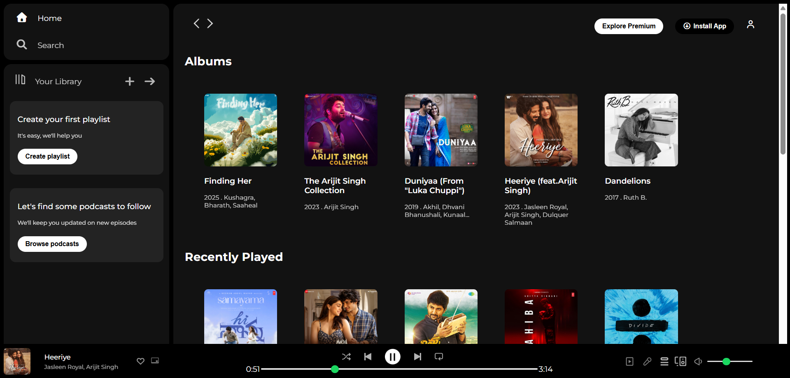

# 🎧 Spotify Web Player Clone

Music isn’t just something we hear - it’s something we experience.
What if you could not only listen to music, but build the player that plays it?

This project started as a simple Spotify UI clone, but I wanted it to feel alive.  
So I turned it into a fully interactive **frontend music player** using pure HTML, CSS, and JavaScript.

🔗 Live Demo:  
https://salma-spotify-clone.netlify.app/

---

## 📸 Preview



---

## 🎵 What You Can Do

- Click any song card → it starts playing instantly  
- Play / Pause toggle with icon switching  
- Album cover, title, and artist update dynamically  
- Real-time progress bar while the song plays  
- Drag to seek through the track  
- Smooth volume control with live percentage feedback  

It’s not just a layout - it behaves like a real music player.

---

## 💻 Frontend Focus

This is a **pure frontend project**.

No backend.  
No frameworks.  
Just core web technologies working together.

While building this, I practiced:

- DOM manipulation  
- Event handling  
- HTMLAudioElement API  
- UI state synchronization  
- Debugging layout issues  
- Clean Git workflow  
- Deployment with Netlify  

This project helped me move from building static pages to creating interactive frontend applications.

---

## 🛠 Tech Used

- HTML5  
- CSS3  
- JavaScript   
- Netlify (Deployment)  

---

## 📂 Project Structure

```
spotify-web-player-clone/
│
├── index.html          # Main structure of the web player
├── style.css           # Styling and layout
├── script.js           # Audio logic & interactivity
│
└── assets/
    ├── audio/          # All MP3 files
    ├── *.jpeg / *.png  # Album covers & player icons
    └── screenshot.png  # Preview image for README
```

## 👩‍💻 About Me

I’m Salma, a Computer Science Engineering student graduating in 2027.  
I love building interactive projects - and music just made this one more fun to create.

---

⭐ If you enjoyed this project, feel free to star the repository!